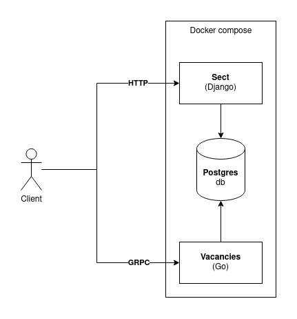

# Sect service
Состоит из двух связанных сервисов:
- Sect (Python Django)
- Vacancies (Go)

Использует Postgres db \
Оба связанных сервиса запускаются вместе от одного docker compose файла


## Идея сервиса
Это сервис для ведения своей секты. Регистрируешься и можешь создавать свою секту, приглашать других юзеров или самому вступать в секту
Есть механика принесения своих последователей в жертву. Принесённый в жертву юзер считается мёртвым и не может больше совершать никаких действий
Есть отдельный сервис для выставления вакансии в свою секту. На вакансию можно откликнуться и получить специальный токен. Введя этот токен на основном сервисе, юзер может вступить в секту
Во время вступления в секту любым способом, юзеру даётся его новое секретное имя в этой секте. Его видит только создатель секты. Для остальных оно скрыто

## Места хранения флагов
Всего есть 2 места для хранения флагов:
1. Описание секты
2. Секретное имя сектанта

# Sect (Django)
## Описание и функционал
При регистрации нового аккаунта есть выбор - разрешать приглашать себя в секты, или нет \
Любой зарегистрированный, но не принесённый в жертву пользователь, может создать секту, выбрав для неё название и описание \ 
После создания секты создатель может приглашать в неё других пользователей из числа тех, кто разрешил себя приглашать. 


# Vacancies (Go)
## Описание и функционал
**Сервис не содержит флагов** \
Позволяет создавать вакансию для вступления в свою секту \
Для одной секты создаётся одна вакансия \
Если юзер откликается на вакансию, то он получает специальный токен, который можно ввести на Django сервисе, чтобы вступить в секту \
Создатель секты может посмотреть токен на странице своей секты \
Откликнуться на вакансию можно только если она активна \
Делать вакансию активной или не активной может только владелец секты


## Детали реализации
Сервис реализует общение с клиентом при помощи GRPC
Сервис связан с основным сервисом на Django только через бд

Для общения с сервисом можно использовать следующие GRPC-клиенты
- CLI [Evans](https://github.com/ktr0731/evans)
- GUI [BloomRPC](https://github.com/bloomrpc/bloomrpc/releases) (проще всего поставить как AppImage)

## Доступные действия
1. Создать новую вакансию
2. Просмотреть список последних сорока вакансий
3. Откликнуться на вакансию / просмотреть одну
4. Редактировать свою вакансию

## Уязвимости
### 1. Создание своей вакансии на чужую секту
В методе `Service.Create` нет проверки на то, что вакансия для конкретной секты уже была создана
Это позволяет создать свою вакансию и получить от неё токен

**Косячный фрагмент**
```
if errors.Is(err, ErrNotFound) {
    err = nil
}
if err != nil {
	return
}
```

**Пофикшенный фрагмент**
```
if err == nil {
	err = errors.New("already exist")
	return
}

if !errors.Is(err, ErrNotFound) {
	return
}
```

### 2. При редактировании можно просмотреть всю информацию о чужой вакансии (включая токен)
В методе `Service.Edit` сначала берётся вакансия из бд, а потом идёт проверка, передал ли юзер правильный токен, чтобы он мог её редактировать
Уязвимость в том, что создаётся переменная `ErrNotOwner`, но она не возвращается. Возвращается целиком структура вакансии `v` и `err` (которая  в тот момент имеет значение `nil`), следовательно юзер получит всю структуру без ошибки

**Косячный фрагмент**
```
if dto.Token != v.Token {
	ErrNotOwner = errors.New("not owner")
	return
}
```

**Пофикшенный фрагмент**
```
if dto.Token != v.Token {
	err = ErrNotOwner
	return
}
```

### 3. SQL - инъекция
В методе `Storage.Get` строится sql запрос
Если закомментить фрагмент `and is_active = true`, то вакансия с токеном будет показываться даже если она не активна


# Checker
Есть два чекера на два места хранения флагов: 
1. Секретные имена сектантов `checker_flagstorage_1.py`
2. Описание секты `checker_flagstorage_2.py`
